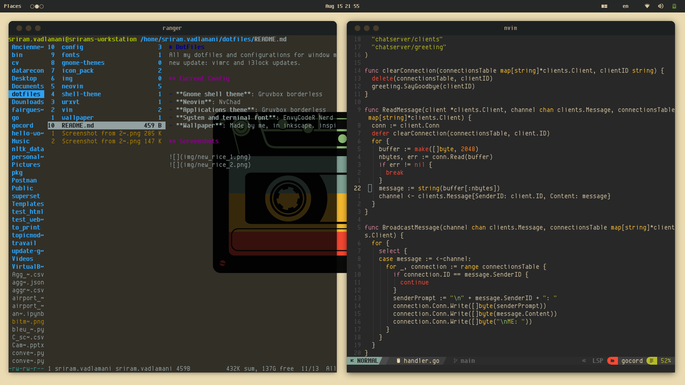
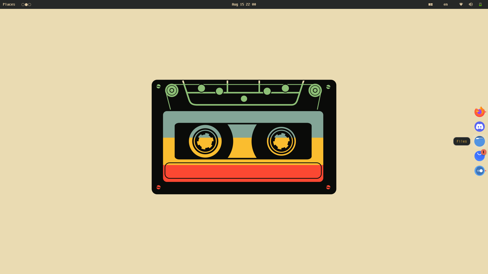

# DotFiles
All my dotfiles and configurations for window manager, application launcher, etc.
new update: vimrc and i3lock updates.

## Current Config

- **Gnome shell theme**: Gruvbox borderless
- **Neovim**: NvChad
- **Applications theme**: Gruvbox borderless
- **System and terminal font**: EnvyCodeR Nerd font
- **Wallpaper**: Made by me, in inkscape. inspired by `u/outlaw-amir` on reddit.

## Screenshots

